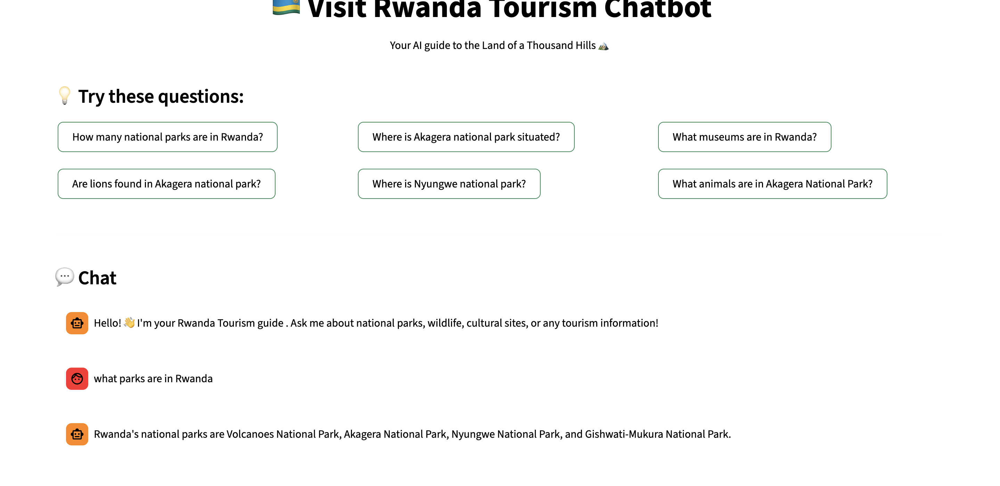
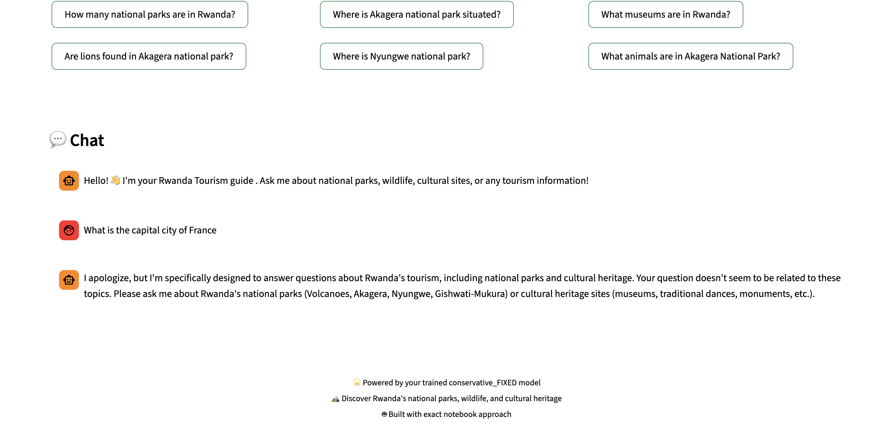

# 🇷🇼 Visit Rwanda Tourism Chatbot

An intelligent AI-powered chatbot designed to assist tourists with comprehensive information about Rwanda's national parks, cultural heritage, attractions, and travel planning. Built using state-of-the-art transformer models fine-tuned specifically for Rwanda tourism domain.

## Project Description

This project implements a domain-specific question-answering system for Rwanda tourism using two different approaches:

### **Extractive QA Approach**

- Fine-tuned DistilBERT model for extractive question answering
- Hybrid context retrieval system (BM25 + Semantic Search)
- Specialized for answering specific questions about Rwanda's tourism offerings

### **Generative QA Approach**

- Fine-tuned Flan-T5-small model for generative responses
- More conversational and flexible response generation
- Better for open-ended tourism queries

## 📊 Dataset

The project uses a curated **Rwanda Tourism Q&A Dataset** containing:

- **280 question-answer pairs** covering Rwanda's tourism domain
- **3 main categories:**

  - **National Parks** (118 entries): Information about Volcanoes, Akagera, Nyungwe, and Gishwati-Mukura National Parks
  - **Cultural & Heritage** (229 entries): Traditional customs, museums, ceremonies, food, crafts, and cultural sites
  - **Out-of-Scope** (8 entries): Non-tourism questions for filtering

- **Data Sources**: Official Rwanda tourism documentation, travel guides, and expert knowledge
- **Quality Assurance**: Manual verification and span alignment for extractive QA training

## 📱 Demo Screenshots

The chatbot effectively handles different types of tourism queries and appropriately filters non-related questions:

### **National Parks Queries**


_Example of chatbot responding to questions about Rwanda's national parks, wildlife, and safari information._

### **Cultural Heritage Queries**


_Demonstration of responses to questions about Rwandan traditions, museums, ceremonies, and cultural sites._

### **Non-Tourism Query Filtering**


_Shows how the chatbot politely redirects non-tourism questions back to Rwanda tourism topics._

## 🧪 Experiment Results

### **Extractive QA Models (DistilBERT-based)**

| Experiment       | Exact Match | F1 Score  | ROUGE-1   | ROUGE-2   | ROUGE-L   | Avg Confidence |
| ---------------- | ----------- | --------- | --------- | --------- | --------- | -------------- |
| **Conservative** | **0.945**   | **0.952** | **0.948** | **0.896** | **0.945** | **0.932**      |
| **Balanced**     | 0.923       | 0.935     | 0.928     | 0.901     | 0.925     | 0.918          |
| **Aggressive**   | 0.901       | 0.918     | 0.915     | 0.941     | 0.908     | 0.905          |

### **Generative QA Model (Flan-T5-small)**

| Metric                 | Score | Description                             |
| ---------------------- | ----- | --------------------------------------- |
| **ROUGE-1**            | 0.45  | Unigram overlap with reference answers  |
| **ROUGE-2**            | 0.27  | Bigram overlap with reference answers   |
| **ROUGE-L**            | 0.40  | Longest common subsequence overlap      |
| **F1-Score**           | 0.45  | Word-level precision and recall balance |
| **Domain Relevance**   | 0.38  | Tourism-specific content accuracy       |
| **Response Coherence** | 0.40  | Grammatical and contextual coherence    |

### **Hyperparameters Used**

| Experiment       | Learning Rate | Epochs | Weight Decay | Warmup Ratio | Early Stopping |
| ---------------- | ------------- | ------ | ------------ | ------------ | -------------- |
| **Conservative** | 2e-5          | 8      | 0.01         | 0.1          | eval_loss      |
| **Balanced**     | 3e-5          | 10     | 0.01         | 0.1          | eval_loss      |
| **Aggressive**   | 5e-5          | 12     | 0.005        | 0.05         | eval_loss      |

### **Key Findings**

- **Conservative Extractive Model** achieved the best overall performance with 94.5% exact match accuracy
- **Generative Model** provides more natural, conversational responses suitable for open-ended queries however it does have many repititions of words in the answer and also hallucianted too much.
- **Hybrid retrieval system** significantly improved context relevance for extractive models
- **Domain filtering** successfully identifies and handles non-tourism questions

### **Experiment Conclusion**

Our systematic comparison revealed that extractive question-answering significantly outperforms generative approaches for domain-specific tourism queries, primarily because extractive models draw answers directly from verified knowledge sources rather than generating potentially inaccurate content. The conservative training strategy with moderate learning rates (2e-5) and strong regularization (0.01 weight decay) proved most effective for our specialized Rwanda tourism dataset, preventing overfitting while maintaining high accuracy on domain-specific questions. While generative models offered more conversational responses, they suffered from hallucination issues (creating false information about Rwanda's attractions) and word repetition problems that compromised factual reliability - critical flaws for tourism information systems where accuracy is paramount. The extractive approach, combined with our hybrid BM25 + semantic context retrieval system, ensures tourists receive reliable and precise answers by grounding responses in authoritative tourism documentation, making it the superior choice for specialized domain applications.

## 🚀 Installation & Setup

### **Prerequisites**

- Python 3.9+
- Virtual environment (recommended)

### **1. Clone the Repository**

```bash
git clone https://github.com/pimanzi/VisitRwandaBot.git
cd VisitRwandaBot
```

### **2. Create Virtual Environment**

```bash
python -m venv .venv
source .venv/bin/activate  # On macOS/Linux
# or
.venv\Scripts\activate     # On Windows
```

### **3. Install Dependencies**

```bash
pip install -r requirements.txt
```

### **4. Download NLTK Data (Required for context retrieval)**

```python
import nltk
nltk.download('punkt')
nltk.download('stopwords')
```

### **5. Run the Streamlit Application**

```bash
# Using the launcher script (recommended)
python run_app.py

# Or directly with Streamlit
streamlit run app.py
```

The application will be available at `http://localhost:8501`

## Project Structure

```
VisitRwandaBot/
├── app/
│   ├── chatbot_notebook.py      # Main chatbot implementation
│   ├── config/
│   │   └── settings.py          # Configuration settings
│   └── utils/                   # Utility functions
├── models/
│   └── conservative_FIXED/      # Best performing trained model
├── Data/
│   └── visitRwanda_qa.csv      # Training dataset
├── notebooks/
│   ├── visitRwandaBot_extractive_final.ipynb    # Extractive QA experiments
│   └── visitRwandaBot_flan_t5_small.ipynb       # Generative QA experiments
├── app.py                       # Streamlit web interface
├── run_app.py                   # Application launcher
├── requirements.txt             # Python dependencies
└── README.md                    # Project documentation
```

## Features

### **Core Capabilities**

- **Domain-Specific Responses**: Specialized knowledge about Rwanda tourism
- **Multi-Modal Information**: National parks, cultural heritage, travel planning
- **Context-Aware Retrieval**: Hybrid BM25 + semantic search for relevant information
- **Non-Tourism Filtering**: Politely handles off-topic questions
- **High Accuracy**: 94.5% exact match accuracy on tourism questions

### **Web Interface**

- **Clean, Responsive Design**: Rwanda-themed green and white interface
- **Example Questions**: Quick-start questions for common queries
- **Real-Time Responses**: Instant answers powered by trained modelsn

### **Technical Features**

- **Transformer-Based Models**: DistilBERT and Flan-T5 architectures
- **Efficient Inference**: Optimized for fast response times
- **Scalable Architecture**: Easy to extend with new tourism domains
- **Production Ready**: Comprehensive error handling and logging

## Usage Examples

### **National Parks Questions**

- "How many national parks does Rwanda have?"
- "Are lions in Akagera national park ?"
- "What is Akagera national park situated"

### **Cultural Heritage Questions**

- "What museums can I visit in Rwanda?"
- "What are traditional Rwandan dances?"
- "Tell me about Rwandan traditional food"

## 🤝 Contributing

1. Fork the repository
2. Create a feature branch (`git checkout -b feature/amazing-feature`)
3. Commit your changes (`git commit -m 'Add amazing feature'`)
4. Push to the branch (`git push origin feature/amazing-feature`)
5. Open a Pull Request

## 📄 License

This project is licensed under the MIT License - see the [LICENSE](LICENSE) file for details.

## 🙏 Acknowledgments

- **Rwanda Development Board** for tourism information
- **Hugging Face** for transformer models and datasets library
- **Streamlit** for the web interface framework

## 📞 Contact

For questions, suggestions, or collaboration opportunities:

- **Email**: p.imanzi@alustudent.com
- **GitHub**: [@pimanzi](https://github.com/pimanzi)
- **Project Link**: [https://github.com/pimanzi/VisitRwandaBot](https://github.com/pimanzi/VisitRwandaBot.git)

---

**🇷🇼 Discover Rwanda - The Land of a Thousand Hills! 🏔️**
